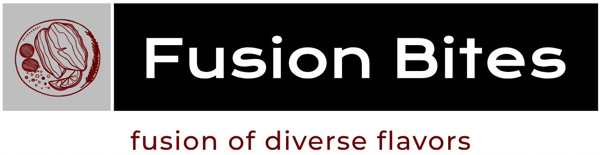

    
<h1>Fusion Bites Restaurant</h1>
Welcome to Fusion Bites Restaurant GitHub repository! This repository contains all the necessary information and resources related to the Fusion Bites Restaurant project.

<h1 id="#top">Table of Contents</h1>

- [About](#about)
- [Features](#features)
- [Installation](#installation)
- [Usage](#usage)
- [Contributing](#contributing)
- [Author](#author)
- [Contact](#contact)
- [Show your Support](#support)
- [Acknowledgments](#acknowledgments)
- [License](#license)

<h2 id="#about">🍽️ About</h2>
Fusion Bites is a unique and innovative restaurant that celebrates the fusion of diverse flavors and culinary traditions from around the world. Our talented chefs combine the best elements of various cuisines to create a harmonious blend of tastes that will tantalize your senses.

[Back to Top ⬆️](#top)

<h2 id="#features">✨ Features</h2>
Culinary Fusion: Explore an exciting menu that seamlessly fuses elements from different cultural cuisines.

[Back to Top ⬆️](#top)

<h3>🌱 Quality Ingredients:  </h3>
We source only the freshest and finest ingredients to ensure an exceptional dining experience.
<h3>🏮Warm Ambiance: </h3>
Our contemporary space provides the perfect backdrop for a memorable gathering with friends and family.
<h3>👩‍🍳Attentive Service: </h3>
Our team is dedicated to providing attentive and friendly service to enhance your visit.

[Back to Top ⬆️](#top)

<h2 id="installation"> 🛠️ Installation</h2>
To run Fusion Bites Restaurant locally, follow these steps:
 

- [Repository Link] (https://github.com/Kaiserabbas/Fusion-Bites.git)

- Clone this repository to your local machine. 
- Install all the necessary dependencies using npm install. 
- Start the local server by running npm start.

[Back to Top ⬆️](#top)

<h2 id="usage">🍴 Usage</h2>
- Browse the menu to explore the exciting fusion dishes. 
- Make reservations for your next dining experience. 
- Discover the story behind Fusion Bites and our culinary inspiration.

[Back to Top ⬆️](#top)

<h2 id="contributing">🤝 Contributing</h2>
We welcome contributions from the open-source community! If you find any issues or have ideas to improve Fusion Bites Restaurant, feel free to submit a pull request. We appreciate your feedback and support.

[Back to Top ⬆️](#top)

<h2 id="author">👥 Author </h2>
👤 Qaisar Abbas 
- Front-end developer with 3+ years of experience building user-friendly and interactive web applications. Proven ability to work independently and as part of a team to deliver high-quality products.

[Back to Top ⬆️](#top)

<h2 id="contact">📞 Contact</h2>
Contact 📞
If you have any inquiries, suggestions, or feedback, please feel free to contact us. You can reach out to us via:

- [Email](kayser.abbas@gmail.com)  
- Phone: +92 314 0071447  
  Social Media: Follow us on Twitter, Facebook, and Instagram for updates and special offers.
- [Github](https://github.com/Kaiserabbas)
- [LinkedIn](https://www.linkedin.com/in/qaisar-abbas-21a93840/)
- [HackerRank](https://www.hackerrank.com/kayser_abbas?hr_r=1)

[Back to Top ⬆️](#top)

<h2 id="support">⭐️ Show your support </h2>
If you like this project feel free to clone it and use it in your own projects and follow the author on Twitter

[Back to Top ⬆️](#top)

<h2 id="acknowledgments">🙏 Acknowledgments</h2>
- I would like to thank Microverse for the opportunity to learn among great aspiring developers

[Back to Top ⬆️](#top)

<h2 id="license">📄 License</h2>
The content of this repository is licensed under the MIT License. Feel free to use, modify, and distribute the code following the terms of the license. 
Thank you for visiting Fusion Bites Restaurant GitHub repository. Enjoy exploring the world of flavors!

[Back to Top ⬆️](#top)
